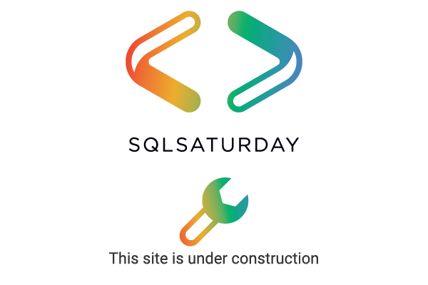

This is a basic code of conduct taken from Redgate Software. At a minimum, your event must adhere to this code of conduct. You can publish a more comprehensive CoC/AHP if you choose.

Note: this policy is under construction and will change over time. Please feel free to submit suggestions to the organization using the contact items below.

SQLSaturday events seek to create a respectful, friendly, patient, considerate, and inclusive event experience, and an environment where all participants feel welcome.

We therefore ask all participants to honor this Code of Conduct. Any kind of disruptive, intolerant or inappropriate behavior will not be tolerated, and we reserve the right to remove any participants who violate our Code of Conduct from the event.

We do not tolerate any harassment or discrimination. Although this list cannot be exhaustive, we explicitly honor diversity in age, gender, gender identity or expression, culture, ethnicity, language, national origin, profession, race, religion, sexual orientation, socioeconomic status, physical and psychological ability, and technical ability.

The organizer of this event will prioritize marginalized people's safety over privileged people's comfort. Please report any concerns, harassing behavior, suspicious, or disruptive activity to the event organizer or staff.
